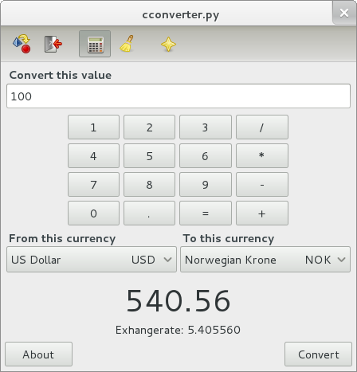

README
******

*Currency Converter* is a simple Gtk application for converting currencies. 
It's written in Python_ making use of the new PyGObject_ bindings.

The application is currently using the exchangerate-api.com_ webservice for
the currency convertions.

*Currency Converter* is developed on Linux and is primarily targeting the
GNOME_ desktop environment, but should run equaly well on platforms with the
necessary dependencies available.

.. _Python: http://python.org
.. _PyGObject: https://live.gnome.org/PyGObject
.. _exchangerate-api.com: http://exchangerate-api.com
.. _GNOME: http://gnome.org

License
=======
*Currency Converter* is licensed under the terms of the GNU General Public 
License (GPL) version 3 [#]_ or later.

.. [#] http://www.gnu.org/licenses/gpl.txt
